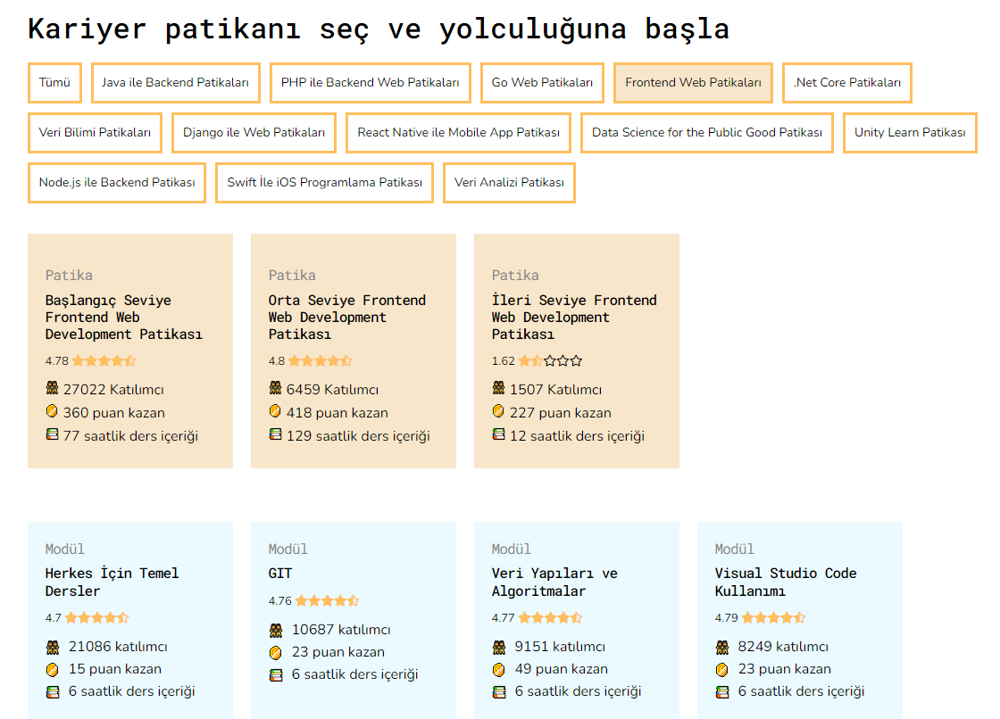

# Kodluyoruz Ilk Repo

[Front-end Patikası](https://app.patika.dev/egitimler/baslangic-seviye-frontend-web-development-patikasi) kapsamında açtığım ilk repo



## Installation

Projeyi clonelamak için: 

```
git clone https://github.com/Noctussi/kodluyoruzilkrepo.git
```

## Usage

Clonelama işleminden sonra projeyi Visual Studio Code programında açmak için:

```
cd kodluyoruzilkrepo
code .
```

## Contributing

Pull requestlerde açıklayıcı commit mesajı yazmayı unutmayın.

## License

[MIT](https://choosealicense.com/licenses/mit/)
